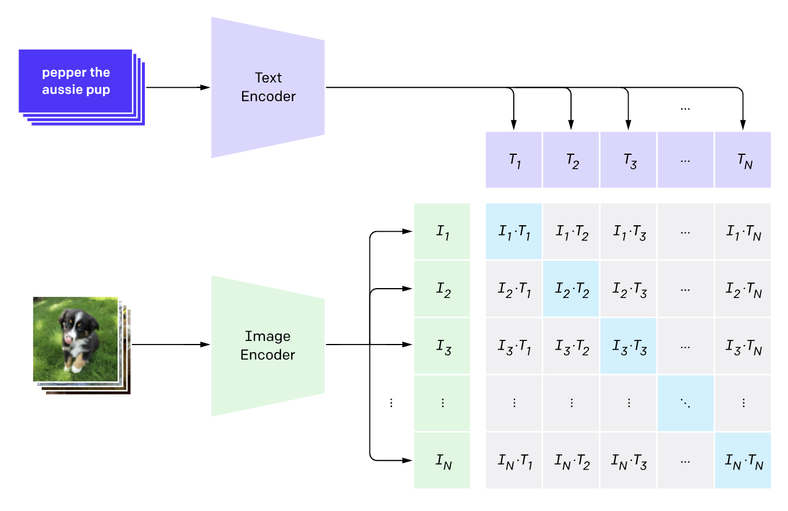
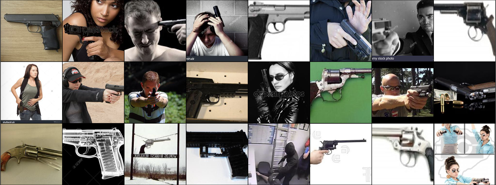
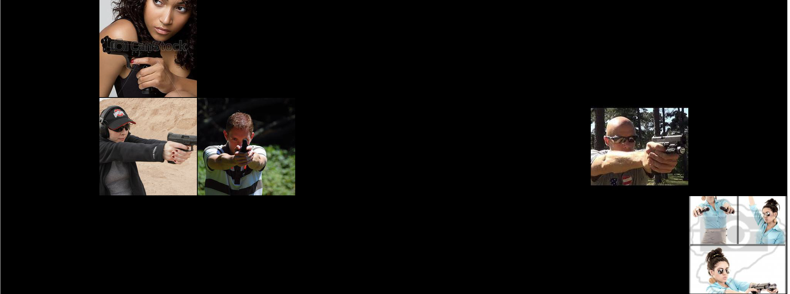
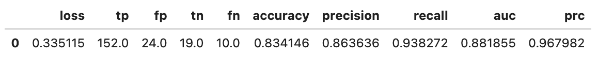

# Capstone
Final DS 222 Capstone

## Packages/Install requirements
Scipy, TensorFlow, & PIL

# Object detection with neural network classification
### Contrastive language image processing with threatening photographs

## The Problem
Nueral network and object detection is a promenient and emergent area of study. With cameras and photographs avaialble in abundance all around the world, many wish to be able to interpret and in my case reduce threats globally. This project pushes the limits of classification to analyze image data and make a compelling prediction on whether a person is holding a weapon. 

## Background
### Threat reduction and image interpretation
In order to have a reliable outcome the image data must be aquired from multiple resources. Without access to survielance camera company data, most of the images must be scraped from public domains on the internet. Without surprise, it is difficult to find high quality images of people holding firearms from a 3rd person point of view. However, I was able to find what would be highly probably image folders to contain a person holding a gun. 

After ammassing photos it next became the challenge of orienting them and both manually and programatically processign them to achieve the cleanest dataset possible. There is quite a bit of noise in the real world especially with photographs so my next step was to use the flexible and adapable image processor known as CLIP. 

## Data Formatting and Modeling
### Data Source, Formatting, and Cleaning
Photos were gathered from a Github repo known as OD weapon detection master set( URL ), otherwise images were webscraped from reddit and google. I provided a unique dataset of my own photographs replicated in similar scenarios and classifified into two distinct groups (human with gun and without). Finally, I supplied an adversarial dataset with images desgined to confuse the model (humans holding packages and guitars).

At first, the images needed to be resized and cropped into a 256 by 256 format so as to save space and training time for the model. A large amount of these images were noisy and unproductive to my problem statement of a person weilding a firearm. In order to combat this I chose to use CLIP (Contrastive Language Image Processing) model to organize and select images containing my desired output. To choose these images CLIP needed a caption and a probability cuttoff which had to be determined from manual inspection. 

^ CLIP pre-trains an image encoder and a text encoder to predict which images were paired with which texts in a dataset. Then it uses this behavior to turn CLIP into a zero-shot classifier, converting all of a dataset’s classes into captions and predict the class of the caption CLIP estimates best pairs with a given image. (source: https://openai.com/blog/clip/)

Example of the CLIP process

### Modeling
The final model consists of rescaling and augementation layers, and a pretrained inception model (with frozen imagenet weights), with a 128 size dense "head" connected to a single binary output neuron.The model was trained using a 80:20 training/validation split using the resized images collected from the various sources. The model was trained until convergence using binary cross entropy as the loss function, at which point it was evaluated on the validation and out of sample datasets.

## Observations
Overall there were a multitude of image collection challenges with images not including humans or falsely labeled as containing a firearm.  

However the results from the final neural network model using transfer learning were strong (90%+ for accuracy) for the in sample dataset. Following this modeling process, It was important to use a out of sample dataset and to also include an adversarial dataset as well.

The metrics for the OOS(out of sample) dataset were slightly less but that is to be expected.

## Next Steps
At this point there is a clear path forward, which would be to increase the image size and amount of total images available to feed into the modeling process. 

As someone who wants to use this implementation of object detection in the real world it is paramount to make sure the objects detected are accurate up to 99.9% of cases. Since this is a matter of security and potentially lives could be at risk the model process needs to be airtight and reliable. 

I am confident that with access to more images and a more stable training dataset that this process could be improved and implemented as a security failsafe anywhere. 